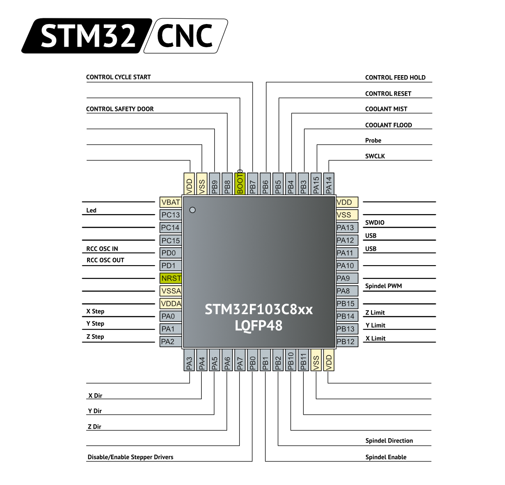

# Source

- https://github.com/gnea/grbl
- https://github.com/usbcnc/grbl
- https://github.com/robomechs/6-AXIS-USBCNC-GRBL

This repository is based on native GRBL 1.1f.

Used:

- [STSW-STM32121. STM32F10x, STM32L1xx and STM32F3xx USB full speed device library (UM0424)](https://my.st.com/content/my_st_com/en/products/embedded-software/mcu-mpu-embedded-software/stm32-embedded-software/stm32-standard-peripheral-library-expansion/stsw-stm32121.license=1601975981254.product=STSW-STM32121.version=4.1.0.html) version 4.1.0

# Description

- SWD work

Pinout

# ChangeLog

0.3:

- Update Full Speed device library to 4.1.0
- Update Virtual Com Port. Misc.h - add type bool.
- Looked at [issue#46](https://github.com/usbcnc/grbl/issues/46) from usbcnc.
  Minor change.

0.2:

- uint16_t probe_invert_mask
- [issue#36](https://github.com/usbcnc/grbl/issues/36) from usbcnc
- [issue#38](https://github.com/usbcnc/grbl/issues/38) from usbcnc
- [issue#40](https://github.com/usbcnc/grbl/issues/40) from usbcnc
- [issue#41](https://github.com/usbcnc/grbl/issues/41) from usbcnc
- [issue#49](https://github.com/usbcnc/grbl/issues/49) from usbcnc

0.1:

- To PlatformIO
